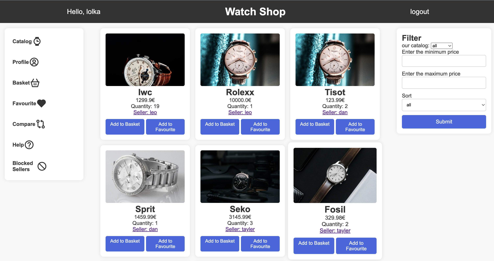
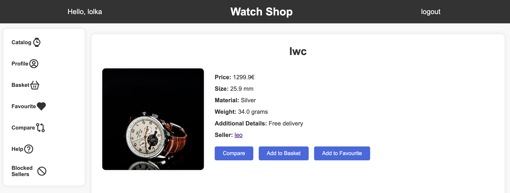
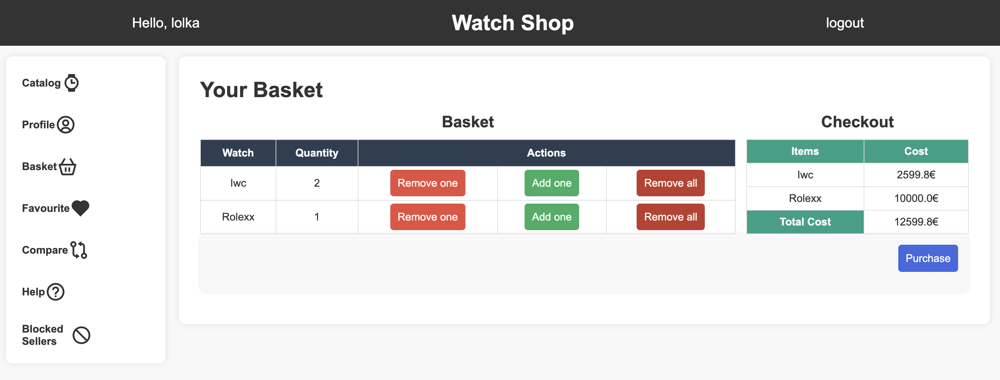
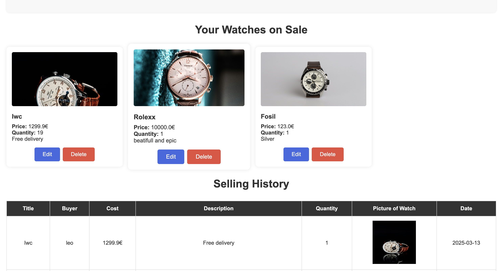
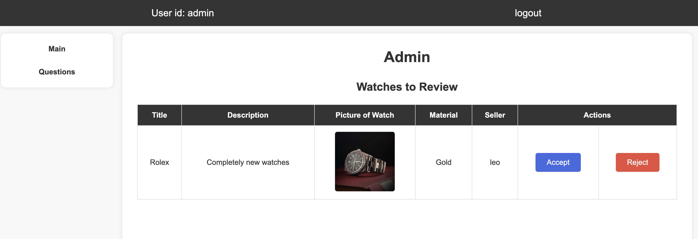
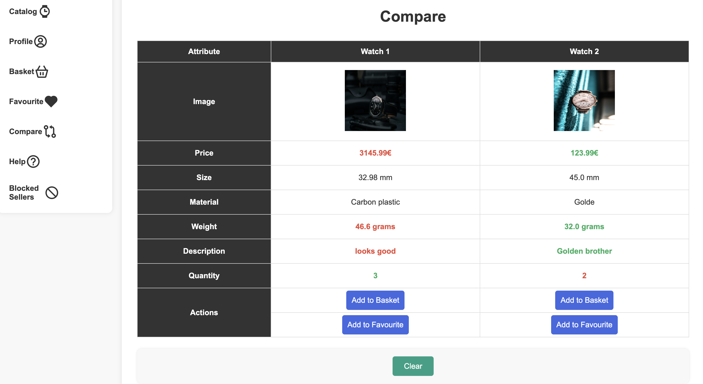

# Watch Shop — Flask E-commerce Web App

A full-stack e-commerce web application for buying and selling watches. The project supports buyer, seller, and admin roles, with features such as product listings, basket management, favourites, product comparison, seller reviews, admin approval workflows, and SQLite persistence.

## Features

- Buyer, seller, and admin account flows
- Product catalogue with watch detail pages
- Basket and checkout logic
- Favourite watches
- Watch comparison feature
- Seller profiles and buyer reviews
- Admin panel for approving or rejecting watches
- Buyer support messages and admin responses
- Modular Flask Blueprint architecture
- SQLite database integration
- Automated tests with pytest

## Tech Stack

- Python
- Flask
- Flask-WTF
- Flask-Session
- SQLite
- Pytest
- HTML
- CSS
- Jinja2 templates

## Project Structure

```text
watch_shop/
├── app/
│   ├── admin/
│   ├── auth/
│   ├── buyer/
│   ├── seller/
│   ├── watches/
│   ├── utils/
│   ├── database.py
│   └── forms.py
├── templates/
├── static/
├── tests/
│   ├── conftest.py
│   ├── test_database.py
│   └── test_routes.py
├── schema.sql
├── init_db.py
├── seed.py
├── config.py
├── main.py
├── run.py
└── README.md
```

## Screenshots

Create a folder called `docs/screenshots/` and add your screenshots there.

### Catalogue Page



### Watch Detail Page



### Basket Page



### Seller Dashboard



### Admin Dashboard



### Compare Watches Page



## How to Run Locally

### 1. Clone the repository

```bash
git clone https://github.com/Leo1267-hub/watch_shop.git
cd watch_shop
```

### 2. Create a virtual environment

```bash
python3 -m venv venv
```

### 3. Activate the virtual environment

On macOS/Linux:

```bash
source venv/bin/activate
```

On Windows:

```bash
venv\Scripts\activate
```

### 4. Install dependencies

```bash
pip install -r requirements.txt
```

If `requirements.txt` is not available yet, install the main packages manually:

```bash
pip install flask flask-wtf flask-session werkzeug pytest
```

### 5. Create and seed the database

This project uses SQLite. The local database file `app.db` is ignored by Git, so create it locally with:

```bash
python init_db.py
python seed.py
```

`init_db.py` creates the database tables from `schema.sql`.

`seed.py` inserts demo buyer, seller, watch, review, and support-message data.

### 6. Run the application

```bash
python run.py
```

Then open the local Flask URL in your browser:

```text
http://127.0.0.1:5000
```

## Running Tests

Run the automated test suite with:

```bash
pytest
```

The tests check that key routes load correctly, protected pages redirect unauthenticated users to login, and the database schema creates the required tables.

## Demo Login Details

Admin login:

```text
Role: admin
Username: admin
Password: 1357
```

Demo buyer:

```text
Role: buyer
Username: demo_buyer
Password: password123
```

Demo seller:

```text
Role: seller
Username: demo_seller
Password: password123
```

You can also register new buyer and seller accounts through the registration page.

## Notes

- `app.db` is ignored because database files should not normally be committed to GitHub.
- `flask_session/` is ignored because it stores local session files.
- The app is structured using Flask Blueprints to keep buyer, seller, admin, authentication, and watch-related routes separated.

## Future Improvements

- Add deployment configuration
- Improve form validation and error handling
- Add image upload validation
- Add pagination for the watch catalogue
